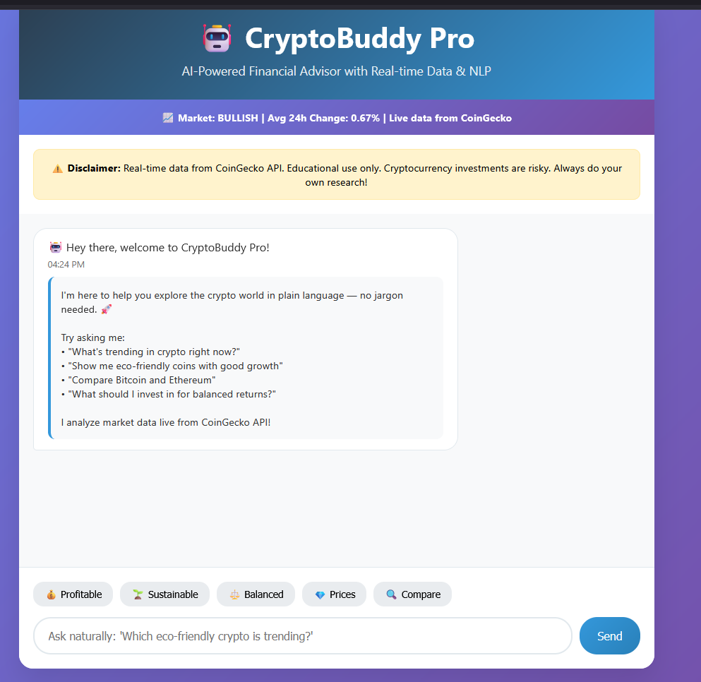

# 💰 CryptoBuddy - Your AI Financial Sidekick 💸


## Overview

CryptoBuddy is an AI-powered chatbot designed to assist users in exploring cryptocurrency investments. Built with Flask (Python) for the backend and HTML/CSS/JavaScript for the frontend, it provides insights into profitable, sustainable, and balanced cryptocurrency options. 💵 The chatbot offers real-time responses based on a predefined cryptocurrency database, helping users make informed decisions while emphasizing that it is an educational tool, not financial advice.

### Features
- **Interactive Chat Interface**: Ask about profitable coins 💸, sustainable options 🌱, or specific cryptocurrencies like Bitcoin or Ethereum.
- **Quick Buttons**: Predefined buttons for quick queries about profitable 💰, sustainable, or balanced recommendations.
- **Responsive Design**: A sleek, modern UI with a gradient background and smooth animations.
- **Predefined Crypto Database**: Includes data on Bitcoin, Ethereum, Cardano, Solana, and Polkadot with metrics like price trends, market cap, energy use, and sustainability scores.
- **Disclaimer**: Clearly states that CryptoBuddy is for educational purposes and not financial advice. ⚠️

## Screenshots

### Chatbot Interface

*Caption*: The main CryptoBuddy interface showing a conversation with the bot. 💬💰

### Python Backend (app.py)

*Caption*: The Flask backend code handling cryptocurrency data and user queries. 💻💸

## Installation

### Prerequisites
- Python 3.8+
- Flask
- A modern web browser (Chrome, Firefox, etc.)

### Setup Instructions
1. **Clone the Repository**:
   ```bash
   git clone https://github.com/your-username/cryptobuddy.git
   cd cryptobuddy
   ```

2. **Install Dependencies**:
   ```bash
   pip install flask
   ```

3. **Run the Application**:
   ```bash
   python app.py
   ```

4. **Access CryptoBuddy**:
   - Open your browser and navigate to `http://localhost:5000`.

## Project Structure
```
cryptobuddy/
│
├── app.py                  # Flask backend handling API and logic 💻
├── templates/
│   └── index.html          # Frontend HTML with CSS and JavaScript 🎨
├── static/                 # Static assets (if any, e.g., images) 🖼️
├── screenshots/            # Screenshots for README 📸
│   ├── chatbot-interface.png
│   └── app-py.png
├── requirements.txt        # Python dependencies 📋
└── README.md               # Project documentation 📝
```

## Usage
- **Start a Conversation**: Type a question in the input box or use quick buttons to ask about profitable coins 💰, sustainable options 🌱, or specific cryptocurrencies.
- **Example Queries**:
  - "Which coins are profitable?" 💸
  - "Tell me about sustainable cryptocurrencies." 🌱
  - "Give me a balanced recommendation." ⚖️
  - "What is Bitcoin's sustainability score?" ₿
- **View Responses**: The bot responds with insights and detailed information in a clean, user-friendly format. 💬

## Technologies Used
- **Backend**: Flask (Python) 🐍
- **Frontend**: HTML, CSS, JavaScript 🌐
- **Styling**: Custom CSS with gradient backgrounds and responsive design 🎨
- **Deployment**: Local server via Flask 🚀

## Contributing
Contributions are welcome! Please follow these steps:
1. Fork the repository. 🍴
2. Create a new branch (`git checkout -b feature/your-feature`).
3. Commit your changes (`git commit -m 'Add your feature'`).
4. Push to the branch (`git push origin feature/your-feature`).
5. Open a Pull Request. 🙌

## Disclaimer
CryptoBuddy is an educational tool and not a source of financial advice. Cryptocurrency investments carry significant risks. Always conduct your own research before making investment decisions. ⚠️💸

## License
This project is licensed under the MIT License - see the [LICENSE](LICENSE) file for details. 📜

## Contact
For questions or feedback, reach out via [GitHub Issues](https://github.com/your-username/cryptobuddy/issues). 📧
