# 💰 CryptoBuddy Pro - Your AI Financial Advisor 💸


## Overview

CryptoBuddy Pro is an advanced AI-powered chatbot designed to guide users through cryptocurrency investments. Built with Flask (Python) for the backend and HTML/CSS/JavaScript for the frontend, it leverages real-time data from the CoinGecko API and natural language processing (NLP) to provide insights into profitable, sustainable, and balanced cryptocurrency options. 💵 The chatbot offers dynamic, user-friendly responses and a modern interface, emphasizing its role as an educational tool, not financial advice.

### Features

- **Natural Language Processing**: Understands natural queries like "Which crypto is trending?" or "Compare Bitcoin and Ethereum." 🗣️
- **Real-Time Market Data**: Fetches live prices, 24h changes, and market cap rankings from CoinGecko API. 📊
- **Interactive Chat Interface**: Ask about profitable coins 💸, eco-friendly options 🌱, or specific cryptocurrencies like Bitcoin or Cardano.
- **Quick Buttons**: Predefined buttons for queries about profitability 💰, sustainability, balance, prices, and comparisons.
- **Market Status Bar**: Displays live market trends (bullish/bearish) with average 24h change. 📈📉
- **Responsive Design**: Modern UI with gradient backgrounds, typing indicator, and urgency highlighting. 🎨
- **Predefined Sustainability Scores**: Evaluates coins like Ethereum, Solana, and Polkadot for environmental impact. 🌍
- **Disclaimer**: Clearly states that CryptoBuddy Pro is for educational purposes only. ⚠️

## Screenshots

### Chatbot Interface

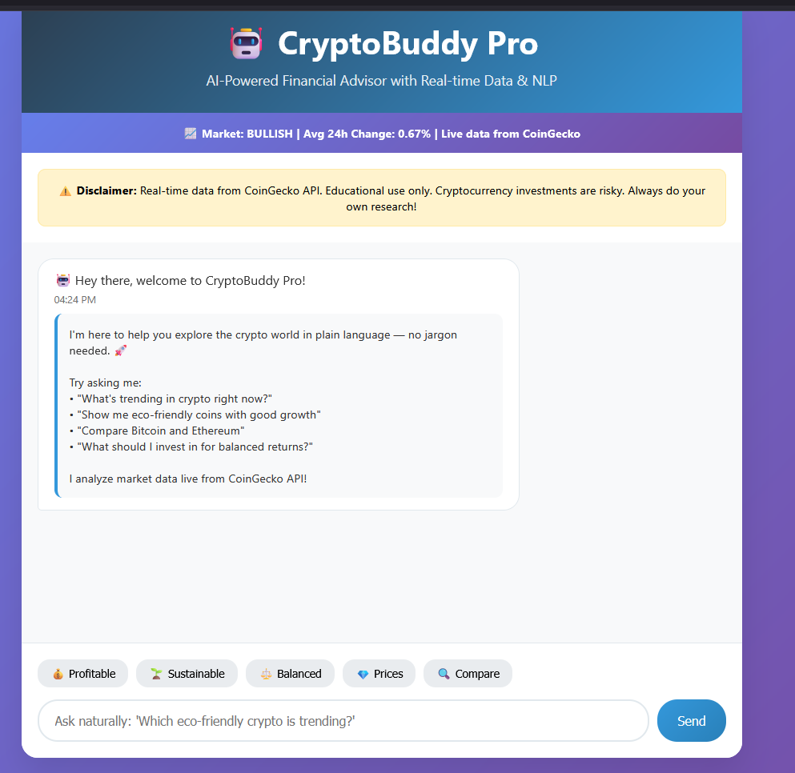
_Caption_: CryptoBuddy Pro's interface with real-time market status and NLP-driven responses. 💬💰

### Python Backend (app.py)

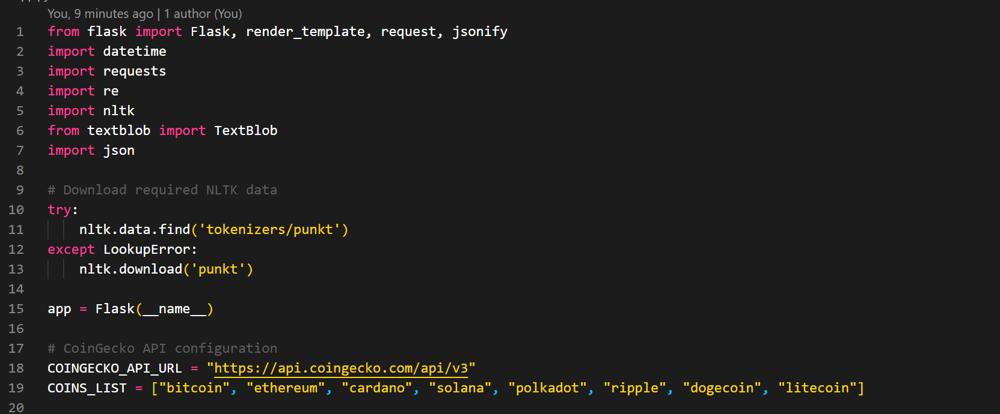
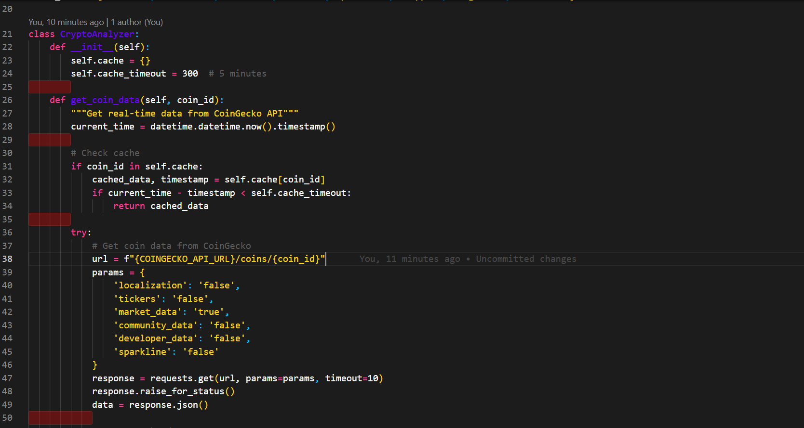
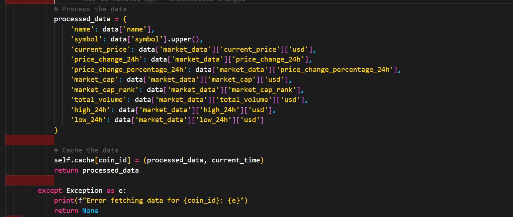
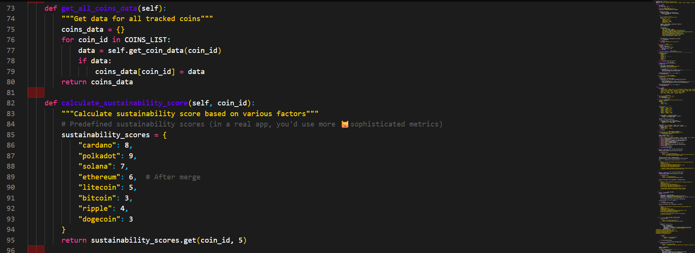
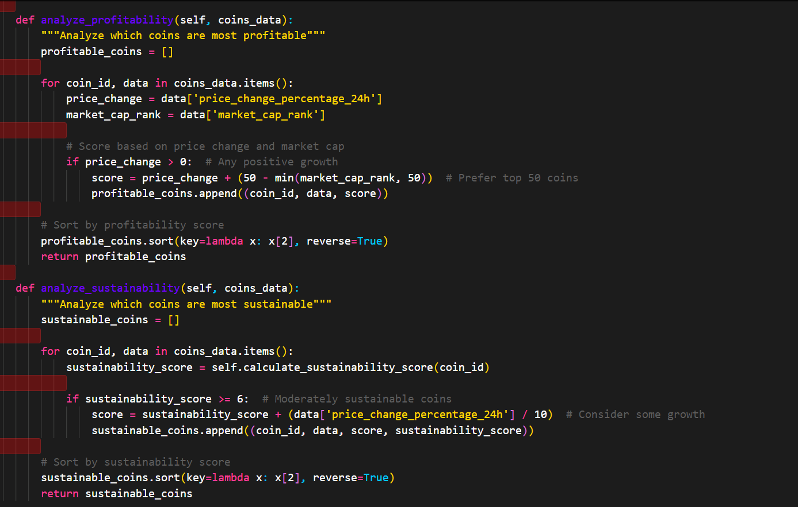
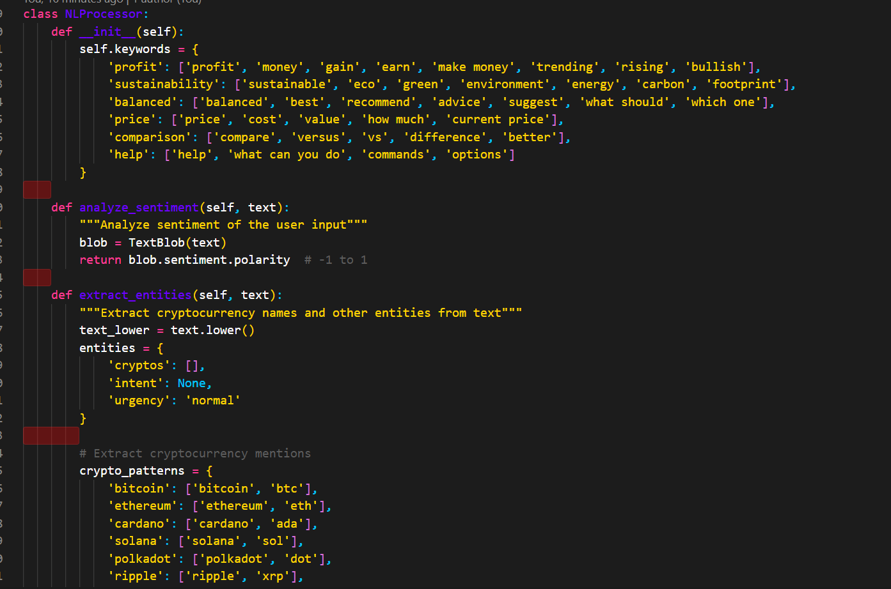
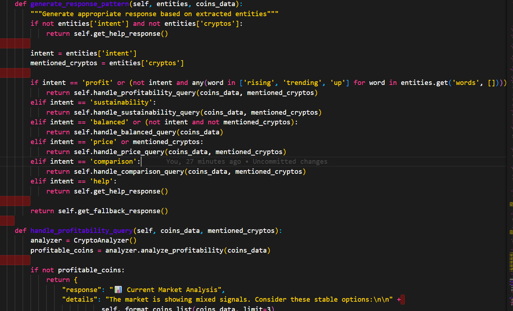
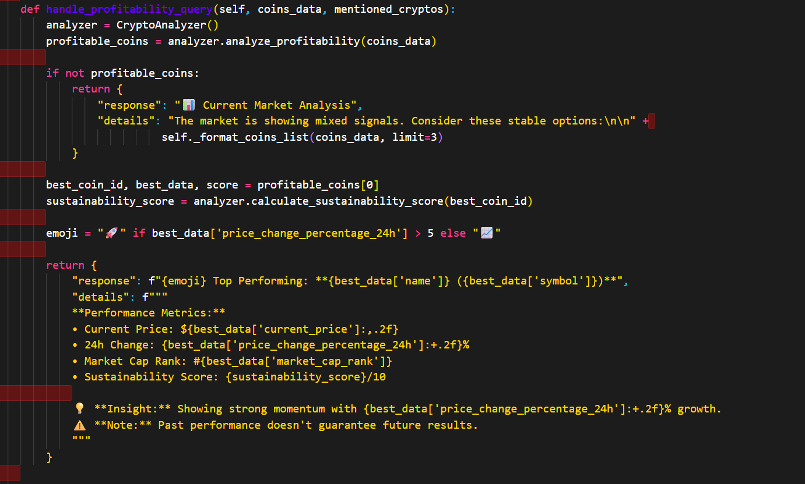
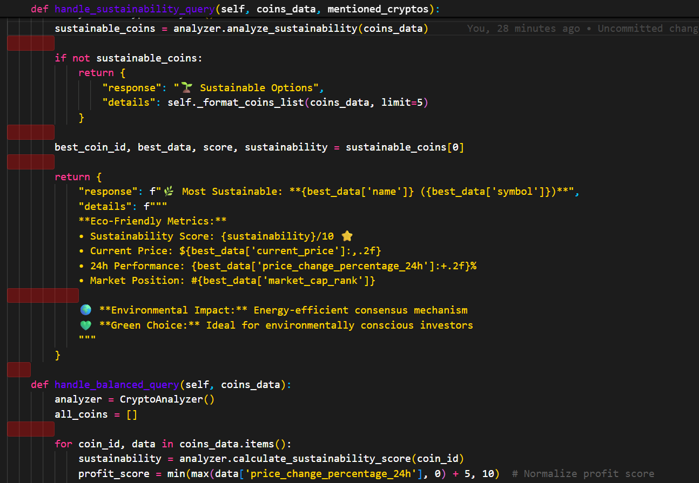
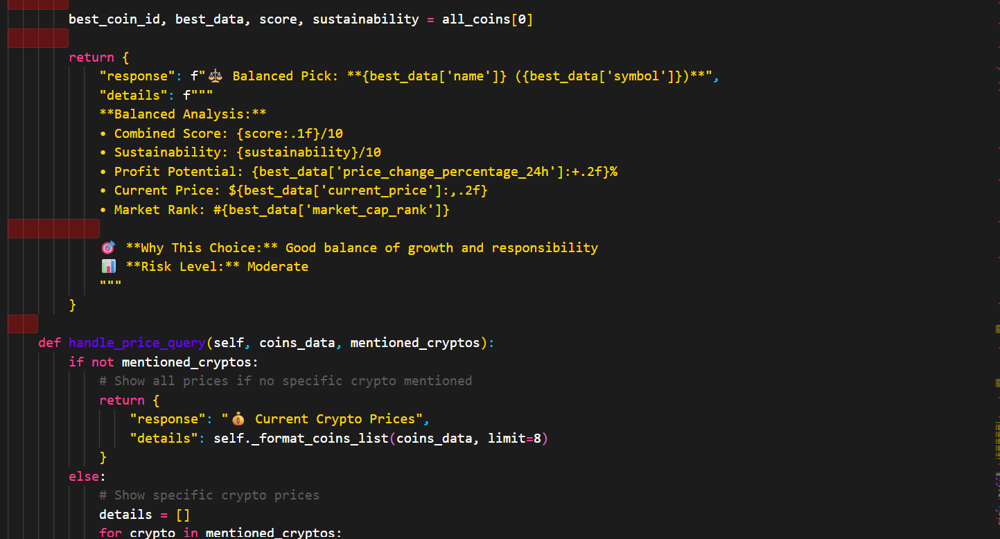
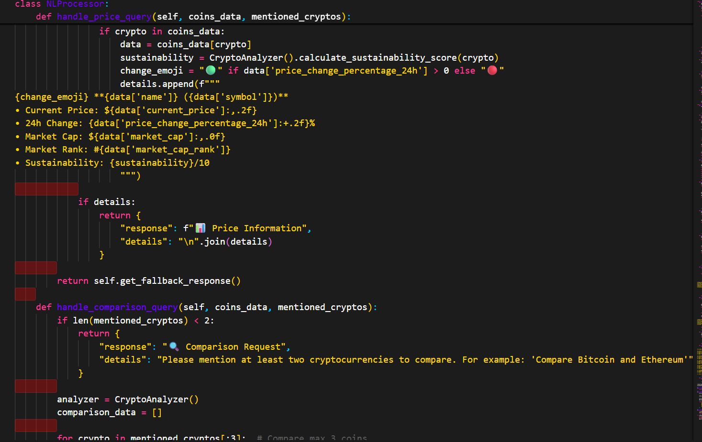
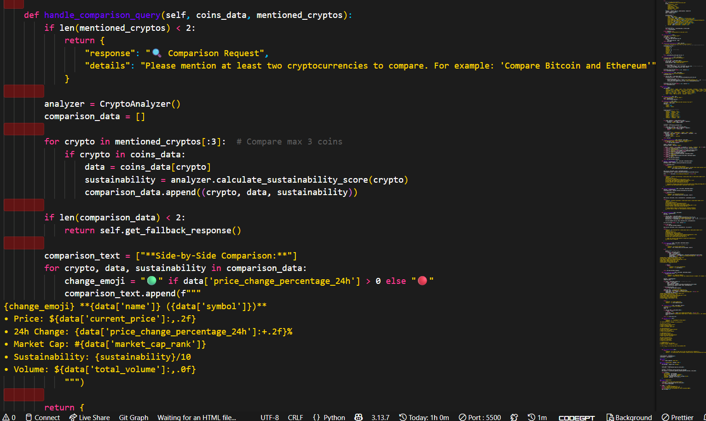
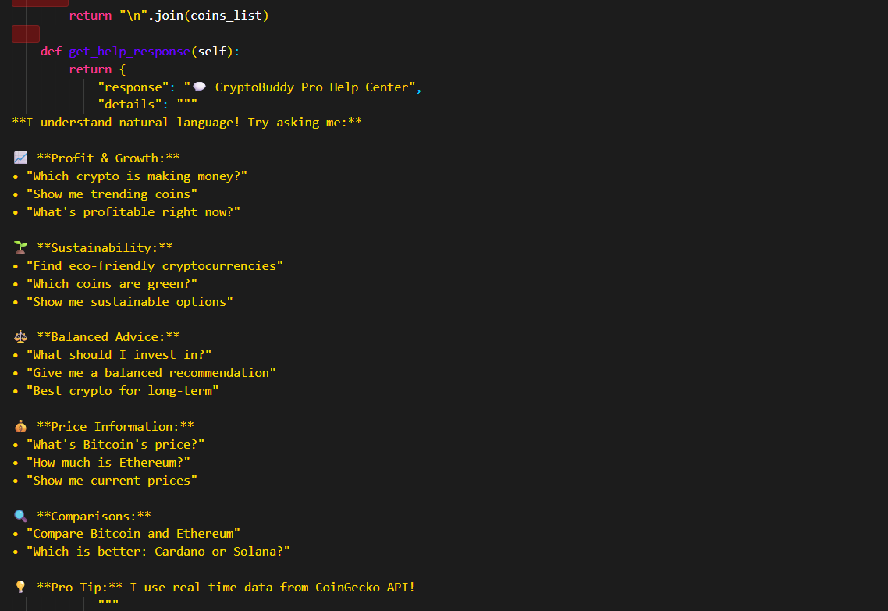

_Caption_: The Flask backend with CoinGecko API integration and NLP processing. 💻💸

## Installation

### Prerequisites

- Python 3.8+
- Flask, requests, nltk, and textblob libraries
- A modern web browser (Chrome, Firefox, etc.)
- Internet connection for CoinGecko API access

### Setup Instructions

1. **Clone the Repository**:

   ```bash
   git clone https://github.com/your-username/cryptobuddy.git
   cd cryptobuddy
   ```

2. **Install Dependencies**:

   ```bash
   pip install flask requests nltk textblob
   ```

3. **Download NLTK Data**:

   ```bash
   python -m nltk.downloader punkt
   ```

4. **Run the Application**:

   ```bash
   python app.py
   ```

5. **Access CryptoBuddy Pro**:
   - Open your browser and navigate to `http://localhost:5000`.

## Project Structure

```
cryptobuddy/
│
├── app.py                  # Flask backend with API, NLP, and CoinGecko integration 💻
├── templates/
│   └── index.html          # Frontend HTML with CSS and JavaScript 🎨
├── static/                 # Static assets (e.g., logo, images) 🖼️
├── screenshots/            # Screenshots for README 📸
│   ├── chatbot-interface.png
│   └── app-py.png
├── requirements.txt        # Python dependencies 📋
└── README.md               # Project documentation 📝
```

## Usage

- **Start a Conversation**: Type natural questions in the input box or use quick buttons for queries like profitable coins 💰, sustainable options 🌱, or price comparisons.
- **Example Queries**:
  - "Which crypto is most profitable right now?" 💸
  - "Show me sustainable eco-friendly coins." 🌱
  - "What should I invest in for balanced growth?" ⚖️
  - "Current Bitcoin and Ethereum prices?" ₿
  - "Compare Cardano and Solana." 🔍
- **View Responses**: The bot provides real-time data-driven insights with detailed metrics like price, 24h change, and sustainability scores. 💬
- **Market Status**: Check the live market trend (bullish/bearish) updated every 30 seconds. 📊

## Technologies Used

- **Backend**: Flask (Python), CoinGecko API, NLTK, TextBlob 🐍
- **Frontend**: HTML, CSS, JavaScript 🌐
- **Styling**: Custom CSS with gradients, typing indicator, and urgency highlighting 🎨
- **Deployment**: Local server via Flask 🚀

## Contributing

Contributions are welcome! Please follow these steps:

1. Fork the repository. 🍴
2. Create a new branch (`git checkout -b feature/your-feature`).
3. Commit your changes (`git commit -m 'Add your feature'`).
4. Push to the branch (`git push origin feature/your-feature`).
5. Open a Pull Request. 🙌

## Disclaimer

CryptoBuddy Pro is an educational tool using real-time data from CoinGecko API and is not a source of financial advice. Cryptocurrency investments carry significant risks. Always conduct your own research before making investment decisions. ⚠️💸

## License

This project is licensed under the MIT License - see the [LICENSE](LICENSE) file for details. 📜

## Contact

For questions or feedback, reach out via [GitHub Issues](https://github.com/your-username/cryptobuddy/issues). 📧
